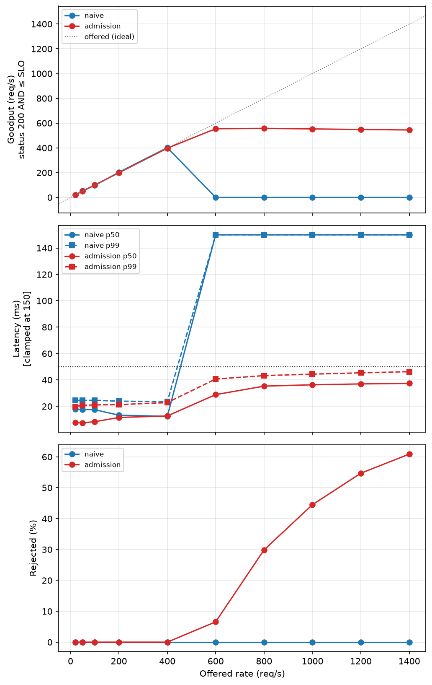

# SLO-Aware ML Inference Server

An inference server that decides **how to batch** and **whether to accept** each request,
so that tail latency stays bounded under overload instead of degrading without limit.

A naive server batches on a fixed rule and accepts everything until it collapses. This one
batches against a measured cost model and refuses work it cannot serve in time — which
means that above capacity it keeps meeting its latency promise for the requests it does
accept, rather than missing it for all of them.

ResNet-50 on ONNX Runtime (CUDA), FastAPI/uvicorn server, and a purpose-built open-loop
C++ load generator. Evaluated on an RTX 4060.

---

## Result



**Naive collapses at capacity; admission control does not.** Above ~658 req/s the naive
server's queue grows without bound, latency climbs past the SLO, and *goodput falls toward
zero — it is still returning HTTP 200s, but too late for any of them to be useful.*
Admission control sheds the excess and holds p99 latency at 48 ms against a
50 ms SLO, sustaining 532 req/s of useful throughput out to 1400 req/s
offered.

Admission control never wins on raw throughput — above capacity both policies push the same
number of requests through the GPU. The win is that one of them is still meeting its
promise.

| | |
|---|---|
| Model / hardware | ResNet-50, ONNX Runtime CUDA EP, RTX 4060 |
| SLO | 50 ms, measured client-side from intended send time |
| Batch cost (fixed shape, B=4) | 6.08 ms |
| Serving capacity | 658 req/s |
| Naive collapse point | ~650 req/s |
| Admission goodput at 1400 offered | 532.4 req/s |
| Admission p50 / p99 at 1400 offered | 38.54 / 47.87 ms |

---

## How it works

```
   requests ──▶ Load Generator ──HTTP──▶ Admission ──▶ Batching ──▶ ONNX Runtime
                (C++, open-loop,          Controller     Scheduler      (CUDA)
                 Poisson arrivals)        accept/reject   size+timeout
```

Three policies, selected by the `SCHEDULER` environment variable:

- **`naive`** — batches form on a fixed timeout, every request is accepted. Unbounded queue.
- **`dynamic`** — batch deadline shortens as the queue deepens; still accepts everything.
- **`admission`** — projects whether an arriving request can complete inside the SLO given
  outstanding work, and rejects it with `503` if not.

The projection is arithmetic, not estimation:

```
projected_ms = ceil(outstanding / MAX_BATCH_SIZE) * per_batch_ms + elapsed_ms
```

`per_batch_ms` is a constant because every batch runs at a **fixed tensor shape** — see
below. That is what makes the controller's prediction exact rather than an online estimate
chasing a moving quantity.

---

## Measurement methodology

Most of the engineering in this project went into being able to trust the numbers. The
findings below are results in their own right; several invalidated everything measured
before them.

**Batch-shape switching costs 5.9×.** Exporting with a dynamic batch axis means every batch
size is a distinct input shape. ONNX Runtime's CUDA convolution kernels re-select their
algorithm when the shape changes, and the cache effectively holds only the last one:

```
ResNet-50   fixed B=6         8.74 ms
            fixed B=7        10.33 ms
            alternating 6,7  56.22 ms      ← 5.9× the expected 9.53 ms
```

The penalty scales with convolution-layer count (~0.85 ms/conv for both ResNet-18 and
ResNet-50), which is what identifies the mechanism. This is a real problem for *any* system
built on dynamic batching, since varying the batch size is the entire point. The fix here
is to pad every batch to a single fixed shape and discard the padding rows — trading a
little wasted compute for a per-batch cost that is genuinely constant.

**Three silent fallbacks, caught by differential measurement.** In each case a component
reported success and did something else:

- *h11 instead of httptools.* Uvicorn falls back to its pure-Python HTTP parser without
  announcing it at INFO level.
- *CPU instead of CUDA.* The CUDA provider failed to load in the server for weeks while
  loading correctly in the validation script — the two processes had different libraries
  preloaded. `get_providers()` reports session-level registration and cannot see per-node
  placement; a configuration check proves nothing about a process it did not run in. The
  server now asserts the resolved provider at startup and refuses to start otherwise.
- *A garbage collector firing on an allocation counter nobody was watching.* See below.

**A 40 ms constant from Nagle / delayed ACK.** The first latency curves were flat at ~41 ms
p50 across every offered rate. Latency invariant to load means a fixed timer, not queueing:
cpp-httplib does not set `TCP_NODELAY`, so small final segments waited on a delayed ACK
(`TCP_DELACK_MIN = HZ/25 = 40 ms`) while the server sat blocked reading the body.

**A periodic runtime stall, diagnosed by load-scaling rather than instrumentation.**
Latency showed 100–150 ms spikes every ~2 s. Halving the offered rate *doubled* the period —
so the trigger was count-driven, not clock-driven, which eliminated every timer-based
suspect in a single run and identified CPython's generational collector. Converting the
period into *requests* rather than seconds is a cheap and general discriminator. Fixed with
`gc.freeze()` after warmup, retuned thresholds, and preallocated columnar metrics buffers so
the live object set stops growing during a run.

**Coordinated-omission-correct load generation.** Latency is measured from each request's
*intended* send time on a fixed Poisson schedule, not from when the client got round to
sending it. The generator reports `send_lag` separately, and a run is invalid if
`send_lag p99` exceeds 5 ms — otherwise a client that falls behind under load silently
under-samples exactly the slow periods it exists to measure.

**HTTP-level admission control pays for the payload it refuses.** The decision point sits
above the transport, so a rejected request has already cost a full 602 KB socket read plus
framework dispatch before `should_admit` runs. That sets a ceiling on how fast the server
can *say no*, independent of how fast it can say yes. Doing admission at the RPC transport
layer — as SVEN does in R2P2 — avoids this; `Expect: 100-continue` is the HTTP-level
approximation.

The batching premise itself was verified rather than assumed:

```
ResNet-18, per-image latency
  batch:     1      2      4      8     16
  GPU:    1.39   0.85   0.66   0.57   0.56 ms     ← 2.5× better with batching
  CPU:    5.68   5.50   5.31   5.37   5.37 ms     ← flat; batching buys nothing
```

---

## Reproduce

```bash
# 1. export the model (dynamo=False — the new exporter silently produced corrupt files)
python scripts/export_model.py

# 2. build the load generator
g++ -std=c++17 -O2 -pthread loadgen/loadgen.cpp -o loadgen

# 3. run the server (restart between runs; --workers 1 is mandatory)
MODEL_PATH=models/resnet50.onnx MAX_BATCH_SIZE=4 SCHEDULER=admission \
uvicorn api:app --host 127.0.0.1 --port 8080 \
  --loop uvloop --http httptools --workers 1 \
  --no-access-log --log-level warning

# 4. one sweep point:  rate workers duration host port fixture out
./loadgen 600 128 60 127.0.0.1 8080 fixtures/sample_input.bin results/admission/rate_600.csv

# 5. plot
python scripts/plot_results.py
```

The server prints its resolved configuration — model path, execution provider, batch size,
scheduler — at startup, and it is recorded in every results file. Given how much of this
project was lost to running a different configuration than intended, that is not optional.

Raw per-request CSVs are gitignored (they run to hundreds of MB); the per-rate summaries in
`results/summary_*.csv` are committed and are what the figures are built from.

---

## Limitations

- **Server-internal vs client-observed SLO.** The controller defends a budget measured from
  the handler's arrival stamp; the client sees additional accept, dispatch and write time.
  Both are reported, but the controller does not model the gap.
- **Single replica, single worker.** `--workers 1` is required because multiple workers mean
  multiple independent schedulers and admission counters. Multi-replica routing (JBSQ-style)
  is not implemented.
- **Fixed-shape padding wastes compute at low load**, where a single-request batch pays the
  B=4 cost. Bounded at 2× and irrelevant against the SLO, but real.
- **The `dynamic` policy is implemented but not swept.** The reported comparison is naive vs
  admission.
- **float32 on the wire.** A uint8 format with the cast folded into the ONNX graph would cut
  the payload 4× and reduce the host-to-device transfer, raising the HTTP-layer ceiling.

## References

- Gujarati et al., [*Serving DNNs like Clockwork*](https://www.usenix.org/system/files/osdi20-gujarati.pdf), OSDI 2020
- Kogias et al., [*R2P2: Making RPCs first-class datacenter citizens*](https://www.usenix.org/system/files/atc19-kogias-r2p2_0.pdf), USENIX ATC 2019 — SVEN, the transport-layer ancestor of this admission controller
- Tene, [*How NOT to Measure Latency*](https://www.youtube.com/watch?v=lJ8ydIuPFeU) — coordinated omission